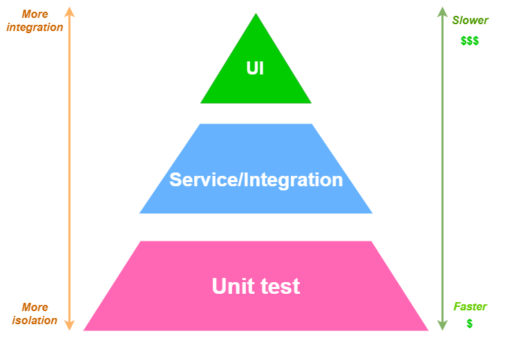

# General Test Concept for SW development projects

Table of Content

1. [Good Unit Tests as Foundation](#Good-Unit-Tests-as-Foundation)
    - [Maturity levels of unit testing](#Maturity-levels-of-unit-testing)
    - [Unit Test Best Practices](#Unit-Test-Best-Practices)
2. [Service Tests](#Service-Tests)
3. [UI Tests](#UI-Tests)
4. [Behavior Driven Development](#Behavior-Driven-Development)
4. [Quotes on Software Testing](#Quotes-on-Software-Testing)

> How much effort to put into automated software tests? 

> Answer: Follow the Testing Pyramid!

## Good Unit Tests as Foundation
- Unit tests are fast and cheap compared to Service/UI tests – so do a lot of them!
- Test the behavior of the unit/module, not the execution of lines! **TEST BEHAVIORS NOT IMPLEMENTATIONS**
- The tests becomes the first cosnumer of your code ! So focus on the public interface of your unit/module, not the internals !
- Recommendation for better unit tests is **Test-Driven-Development**
    - First write the test, then the production code and then refactor - "RED-GREEN-REFACTOR" pattern
    - See https://www.codica.com/blog/test-driven-development-benefits/
- Some best practices on TDD:
    - The unit under test should have only one public/exposed interface (libraries are exceptions). Respect information hiding and abstraction when writing the test / designing your public interface !
    - You don't just write a test, you design a public interface for your unit under test ! Keep a thin public API !
    - Tests should have as less dependecies as possible. Meaning also less mocking because what you mock is a dependency.
      
- Test coverage could also be used i.e. at least 80% line coverage
    
    > ATTENTION: Don’t fall into the trap, "The higher the code coverage, the better the tests."! This number must be treated carefully. Test behavior, not lines of code!

    - Decide on C1 or C2 code coverage in your developer team
        - Line/Statement or Branch coverage (C1/C2)
        - “Most professional software developers use C1 and C2 coverage. C1 stands for statement coverage and C2 for branch or condition coverage. With a combination of C1 and C2, it is possible to cover most statements in a code base. Statement coverage would also cover function coverage with entry and exit, loop, path, state flow, control flow and data flow coverage. With these methods, it is possible to achieve nearly 100% code coverage in most software projects.” - see https://en.wikipedia.org/wiki/Code_coverage#

- Unit tests should be executed in CI/CD pipeline and a failed unit tests causes failure in the CI/CD pipeline as well (build failure)
    - also not achieving the test coverage percentage i.e. 80% leads to failure of CI/CD pipeline

### Maturity levels of unit testing
- Level 0:
    - no unit tests at all (RED FLAG)
    - Only Manual Testing after development!
- Level 1:
    - Level 0 +
    - unit tests + 
    - line code coverage percentage defined in the development team (i.e. 80%) +
    - Execution of unit tests in the CI/CD pipeline for every build +
    - CI/CD build fails when tests are failing or code coverage percentage is not achieved
- Level 2:
    - Level 1 + 
    - apply actively **Test-Driven-Development** (TDD) in the development team (partially or entirely in the team)
        - In case partially: You try to establish TDD for all developer in future!
        - Not all the time you must do TDD. When you do this most of the time (80-90%), it’s great!

### Unit Test Best Practices

You don’t know the best practices for unit testing, then watch these videos: 
- [Effective Unit Testing by Eliotte Rusty Harold](https://www.youtube.com/watch?v=fr1E9aVnBxw)
- [Your Unit Tests are Trying To Tell You Something by Victor Rentea](https://youtu.be/1-Aw-sRfqsQ)

## Service Tests
- Testing of APIs/microservices (incl. DB)
    - testing all microservice without UI (API based testing)
    - also a single microservice can be tested here (Component test)
- Testing the key functionality should be done here or on Unit Test level, NOT in UI tests !!!

## UI Tests
- End-2-End tests which test the entire system (**Automated System Test**)
    - simulates user behaviour on UI
- Most expensive and slowest (slow in execution and writing) tests
    - very often flaky (unreliable) - see [Flaky Tests at Google and How We Mitigate Them](https://testing.googleblog.com/2016/05/flaky-tests-at-google-and-how-we.html)
- Only a few (most important functions) should be tested
- Functionality under test should not change very frequently
- Use state-of-the-art test frameworks for UI testing (something like Playwright, Cypress, Selenium etc.)
- UI-tests can also be executed MANUALLY but be careful (very costly, time-consuming and unreliable)
- Think about cross-browser testing and responsive behaviour (web/mobile apps)
    - Something like [Browser Stack](https://www.browserstack.com/?utm_source=google&utm_medium=cpc&utm_platform=paidads&utm_content=668760067900&utm_campaign=Search-Brand-EMEA-Navigational&utm_campaigncode=Core+1004615&utm_term=e+browser%20stack) could help

## Behavior Driven Development
- Recommendation for better testing and better communication between Devs and Business can be achieved by **Behavior Driven Development** (BDD)
    - BDD enables business team and devs to create their own test language
    - By this test language, the devs can then implement the tests
- In theory you can apply BDD on every level of the test pyramid. In my experience on unit testing level it puts more overhead to testing. That's why I'd apply it in Service/Integration test level or UI testing level.

## Quotes on Software Testing

- Design to Test
- Test your Software, or your users will
- Coding Ain't Done 'Til All the Tests Run
- Test Early. Test Often. Test Automatically.
- Test your Estimates
- Test State Coverage, Not Code Coverage
